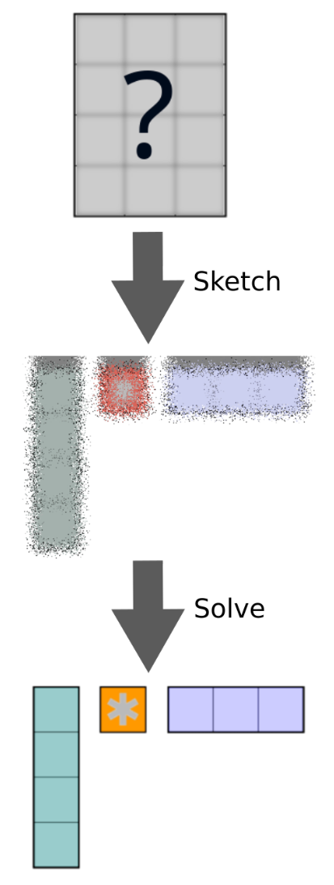

<p align="center">
    
    
</p>


<h3 align="center">
<code>skerch</code>: Sketched linear operations for PyTorch
</h3>


<div align="center">

|                                                             PyPI                                                                 |                                                                             Docs                                                                             |                                                                                                  CI                                                                                                  |                                                                                    Tests                                                                                    |
|:--------------------------------------------------------------------------------------------------------------------------------------------:|:---------------------------------------------------------------------------------------------------------------------------------------------------------------------:|:----------------------------------------------------------------------------------------------------------------------------------------------------------------------------------------------------:|:------------------------------------------------------------------------------------------------------------------------------------------------------------------------------:|
| [](https://pypi.org/project/skerch/) | [](https://skerch.readthedocs.io/en/latest/?badge=latest) | [](https://github.com/andres-fr/skerch/actions) | [](https://coveralls.io/github/andres-fr/skerch?branch=main) |

</div>


# What is `skerch`?

`skerch` is a Python package to compute different sketched linear operations, such as SVD/EIGH, diagonal/triangular approximations and operator norms. See the [documentation](https://skerch.readthedocs.io/en/latest/index.html) for more details and usage examples. Main features:

* Built on top of PyTorch, naturally supports CPU and CUDA, as well as complex datatypes. Very few dependencies otherwise
* Rich API for matrix-free linear operators, including matrix-free noise sources (Rademacher, Gaussian, SSRFT...)
* Efficient parallelized and distributed computations
* Support for out-of-core operations via [HDF5](https://www.h5py.org/)
* A-posteriori verification tools to test accuracy of sketched approximations
* modular and extendible design, for easy adaption to new settings and operations

# Why sketches? Why `skerch`?

Sketched methods are a good choice whenever we are dealing with *large* objects that can be approximated by *smaller* substructures (e.g. a low-rank approximation of a large matrix).
Thanks to the random measurements (i.e. the "sketches"), we can directly obtain the *small* approximations, without having to store or compute the *large* object. This works with very few assumptions about how the smaller substructure looks like.

For example, if we have a large linear operator of dimensionality `(N, N)` that doesn't fit in memory, but has rank `k`, we can directly retrieve its top-`k` singular components with only `O(Nk)` storage, as opposed to the intractable `O(N^2)` (see picture below for an intuition). As a bonus, this technique is numerically stable and can be parallelized, which often results in substantial speedups.

And since `skerch` is built on top of PyTorch and with very few dependencies otherwise, it supports a broad variety of platforms and datatypes, including e.g. complex datatypes on GPU.
Its modular and extendible design, featuring many common components of sketches, is also meant to reduce development times whenever new settings or methods are being explored.
Last but not least, `skerch` also provides functionality to store and manipulate large tensors in a distributed fashion via `HDF5` tensor databases, useful for out-of-core computations.

In summary, `skerch` is made to deal with linear objects that are large and slow, resulting in substantially faster and more scalable operations during runtime, and overall faster development times. Give it a try!

<p align="center">
  
</p>


# Installation and basic usage

Install via:

```bash
pip install skerch
```

```
TODO:

1. Add integration tests:
* synthmat notebook, with a plot like sketchlord
* Low-rank approximations (provide boxplot for runtimes and errors compared to classical. +aposteriori)
* Diagonal and triangular approximations (also boxplot +aposteriori)
* HDF5 files for out-of-core operations
* Approximating deep learning curvature matrices (boxplot? +aposteriori)
* update readme with reference to examples


2. add remaining todos as GH issues
* xtrace
* HDF5 measurement/wrapper API
* out-of-core linalg routines compatible with HDF5 (QR, SVD, LSTSQ). Mention issues with dask.
* triang: stairs should include bits of main diag
* it seems that SSVD busts when we have slow spec decay, unlike PT impls (check lowrank integration test with decay=0.01)
* JIT optimizations
* autograd?

3. Release
* Review all docstrings, lint... check webdocs and latex look OK
* Check all makefile functions run OK
* no dumb files or text hanging (_old?)
* Merge PR (changelog?)

4. Verify
* check online docs
* follow instructions from scratch to reproduce all examples
* run utests, all should pass


CHANGELOG:
* Better test coverage -> less bugs
* Clearer docs
* support for complex datatypes
* Support for (approximately) low-rank plus diagonal synthetic matrices
* Linop API:
  - New core functionality: Transposed, Signed Sum, Banded, ByBlock
  - Support for parallelization of matrix-matrix products
  - New measurement noise linops: Rademacher, Gaussian, Phase, SSRFT
* Data API:
  - Batched support for arbitrary tensors in distributed HDF5 arrays
  - Modular and extendible HDF5 layouts (oversampled, nystrom...)
* Sketching API:
  - Modular measurement API supporting multiprocessing and HDF5
  - Modular recovery methods (singlepass, Nystrom, oversampled)
* Algorithm API:
  - Algorithms: XDiag/DiagPP, XTrace/TracePP, SSVD, Triangular, Norms
  - Efficient support for Hermitian versions
  - Dispatcher for modularized use of noise sources and recovery types
  - Matrix-free a-posteriori error verification
```

The sketched SVD of a linear operator `op` of shape `(h, w)` can be then computed simply via:


```python
from skerch.decompositions import ssvd

q, u, s, vt, pt = ssvd(
    op,
    op_device=DEVICE,
    op_dtype=DTYPE,
    outer_dim=NUM_OUTER,
    inner_dim=NUM_INNER,
)
```

Where the number of outer and inner measurements for the sketch is specified, and `q @ u @ diag(s) @ vt @ pt` is a PyTorch matrix that approximates `op`, where `q, p` are *thin* orthonormal matrices of shape `(h, NUM_OUTER)` and `(NUM_OUTER, w)` respectively, and `u, vt` are *small* orthogonal matrices of shape `(NUM_OUTER, NUM_OUTER)`.

The `op` object must simply satify the following criteria:

* It must have a `op.shape = (height, width)` attribute
* It must implement the `w = op @ v` right-matmul operator, receiving and returning PyTorch vectors/matrices
* It must implement the `w = v @ op` left-matmul operator, receiving and returning PyTorch vectors/matrices

`skerch` provides a convenience PyTorch wrapper for the cases where `op` interacts with NumPy arrays instead (e.g. [SciPy linear operators](https://docs.scipy.org/doc/scipy/reference/generated/scipy.sparse.linalg.LinearOperator.html) like the ones used in [CurvLinOps](https://github.com/f-dangel/curvlinops)).

To get a good suggestion of the number of measurements required for a given shape and budget, simply run:

```bash
python -m skerch prio_hpars --shape=100,200 --budget=12345
```

The library also implements cheap *a-posteriori* methods to estimate the error of the obtained sketched approximation:


```python
from skerch.a_posteriori import a_posteriori_error
from skerch.linops import CompositeLinOp, DiagonalLinOp

# (q, u, s, vt, pt) previously computed via ssvd
sketched_op = CompositeLinOp(
    (
        ("Q", q),
        ("U", u),
        ("S", DiagonalLinOp(s)),
        ("Vt", vt),
        ("Pt", pt),
    )
)

(f1, f2, frob_err) = a_posteriori_error(
    op, sketched_op, NUM_A_POSTERIORI, dtype=DTYPE, device=DEVICE
)[0]
print("Estimated Frob(op):", f1**0.5)
print("Estimated Frob(sketched_op):", f2**0.5)
print("Estimated Frobenius Error:", frob_err**0.5)
```

For a given `NUM_A_POSTERIORI` measurements (30 is generally OK), the probability of `frob_err**0.5` being wrong by a certain amount can be queried as follows:

```bash
python -m skerch post_bounds --apost_n=30 --apost_err=0.5
```

See [Getting Started](https://skerch.readthedocs.io/en/latest/getting_started.html), [Examples](https://skerch.readthedocs.io/en/latest/examples/index.html), and [API docs](https://skerch.readthedocs.io/en/latest/skerch.html) for more details.

# Developers

Contributions are welcome under this repo's [LICENSE](LICENSE).

Feel free to open an [issue](https://github.com/andres-fr/skerch/issues) with bug reports, feature requests, etc.

The documentation also contains a [For Developers](https://skerch.readthedocs.io/en/latest/for_developers.html) section with useful guidelines to interact with this repo and propose pull requests.


# Researchers

If this library is useful for your work, please consider citing it:

```
@manual{fernandez2024skerch,
  title={{S}kerch: Sketched matrix decompositions for {PyTorch}},
  author={Andres Fernandez},
  year={2024},
  url={https://github.com/andres-fr/skerch},
}
```
